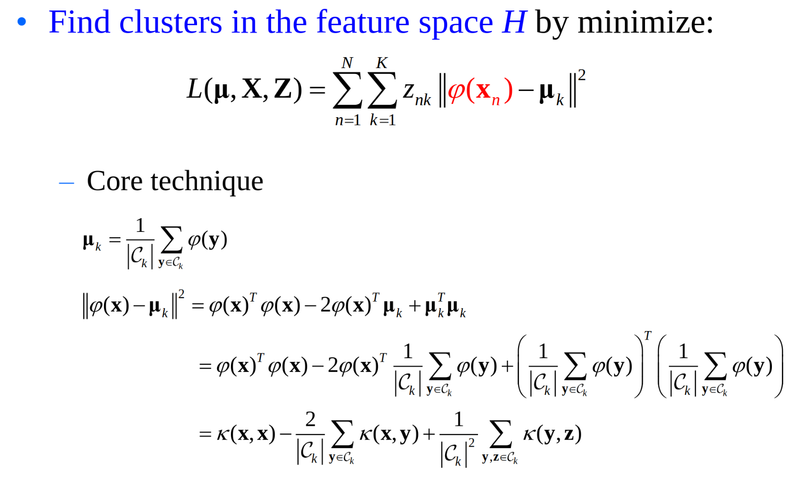

# 数据聚类

聚类：物以类聚，人以群分。

对一批没有类别标签的样本集，按照样本之间的相似程度分类，相似的归为一类，不相似的归为其它类。称为聚类分析，也称为无监督分类。

聚类任务：样本集的一个划分。每个划分中一部分叫做类或者簇。可以通过类中心或者类的边界点表示。

## 距离与相似度度量

集合相似性，先计算如下几个值

- $f_{00}$：样本x和y中满足 $x_i=y_i=0$ 的属性个数。
- $f_{10}$：样本x和y中满足 $x_i= 1 ,y_i=0$ 的属性个数。
- $f_{01}$：样本x和y中满足 $x_i= 0 ,y_i=1$ 的属性个数。
- $f_{11}$：样本x和y中满足 $x_i= 1 ,y_i=1$ 的属性个数。

简单匹配系数SMC：$S(x,y) = \frac{f_{00} + f_{11}}{f_{00} + f_{10} + f_{01} + f_{11}}$

Jaccard 相似系数：$S_J(x,y) = \frac{f_{11}}{f_{10} + f_{01} + f_{11}}$

Tanimoto 系数： $S_T(x,y) = \frac{x^Ty}{x^Tx + y^Ty - x^T y} = \frac{f_{11}}{x^Tx + y^Ty - f_{11}}$

类之间的距离可以是最短距离法、最长距离法。

!!! note "k-means clustering"

    初始化需要给出聚类的个数k，然后随机k个初始中心点。

    对于每个样本点，将他聚类到距离最近的中心。

    然后更新每一个聚类的中心点 $\mu_k =  mean(C_k) = \frac{1}{|C_k|} \sum x_n$

    损失函数为 $L(\mu,x_n,z_n) = \sum z_{nk} ||x_n - \mu_k||^2$ ，其中 $z_{nk}$ 是将这个样本分为这个类的onehot编码。

    k-means 算法更新分为两步：1.固定 $\mu$ ，改变z(one hot 编码，就是分成那个类)。2. 固定z，修改中心 $\mu$

    如何避免局部最小化，只能仔细地选择初始的值。

!!! note "mean-shift clustering"

    是一个基于滑动窗口的算法，找到一个数据点最密集的区域。

    每次从mean周围的窗口中，更新候选点。

    开始有一个radius r，mean shift 是一个爬山算法，每次从kernel 改进到一个更加高密度的，直到结束。

    需要设计window的窗口大小r。

DBSCAN 算法，开始的随意开始一个没有用过的点，所有距离小于 $\varepsilon$ 的都是邻居。需要有足够数量的邻居，会被标记成一个新的聚类，否则被标签为噪音。对于有聚类的点，这个点和 $\varepsilon$ 距离内的邻居是相同的聚类。重复这个过程直到所有点都被使用过。

!!! note "Gaussian Distribution"

    $N(x|\mu, \sum) = \frac{1}{(2 \pi |\sum |)^{\frac{1}{2}}} exp \{ - \frac{1}{2} (x - \mu) ^T \sum^{-1} (x-  \mu)\}$

    使用em算法。

## Hierarchical Clustering

分级聚类。这种思想可以自然地应用到聚类分析中，称为分级聚类，层级聚类或者系统聚类。

可以自底向上凝聚的层次聚类：将每个样本作为一个簇，然后根据给定的规则逐渐合并一些样本，形成更大的簇，知道所有的样本都被分到一个合适的簇中。

自顶向下的分裂的层次聚类：将所有的样本置于一个簇中，然后根据给定的规则逐渐细分样本，得到越来越小的簇，直到某个终止条件得到满足。

!!! note "自底向上凝聚的层次聚类"

    合并：计算任意两个类之间的距离（相似性），将距离最小的两个类合并为一个类，其余类不变。（类似于哈夫曼编码）

    系统树可以来描述这种聚类结果。

分级聚类两个核心问题：如何度量两个样本之间的聚类，如何度量两个簇之间的聚类。

实践：根据数据特性、聚类目标的不同，通常需要采用不同的簇间距离。对同一数据集，采用不同的簇间距离通常会得到不同的聚类结果。

总结：

不需要特殊指定聚类的数量。

分级树对于人类阅读很有友好。

时间复杂度为 $O(n^2)$

## Spectral Clustering

谱学习方法：广义上讲，任何在学习过程中应用到矩阵特征值分解的方法均叫做谱学习方法，比如主成分分析（PCA）、线性判别分析（LDA）、流形学习中的谱嵌入方法、谱聚类等等。

谱聚类：建立在图论的谱图理论基础之上，其本质是将聚类问题转化为一个图上的关于顶点划分的最优问题。建立在点对相似性基础之上。

Laplacian matrix 拉普拉斯矩阵： $L = D - W$

基于数据集图构建：每个样本点构造一个顶点。构造边集：全连接；局部连接：k-邻近， $\varepsilon$ 邻近。

子图的势 $|A|$：等于A所包含的顶点个数。

字符的体积 $val(A)$：等于A中所有顶点的度之和。

子图相似度：子图A与子图B的相似度定义为连接两个子图所有边的权重之和。$w(A,B) = sum_{i \in A,j \in B} w_{ij}$，其实就是割。

最小二分割在实践中，目标函数通常将一个点从其余各点中分离出来，这个不是我们所期望的。

于是使用归一化的最小二分割：对子图的规模进行限制，希望两个子图的规模不要相差太大，于是使用目标函数 $R(A,\overline{A}) = \frac{1}{2} (\frac{cut(A,\overline{A})}{|A|} + \frac{cut(A,\overline{A})}{|\overline{A}|})$，或者 $Ncut(A,\overline{A}) = \frac{1}{2}  (\frac{cut(A,\overline{A})}{vol(A)} + \frac{cut(A,\overline{A})}{val{\overline{A}}})$

图的k-切割。

谱分析在线性代数中：矩阵的基本特征，特征对。使用特征对去解决问题的方法。

!!! note "谱聚类"

    构建一个相似图，计算出拉普拉斯矩阵L。

    计算k个L的最小的特征向量 $\mu_1,\mu_2,....,\mu_k$。

    记 $U = [\mu_1,\mu_2, ...,\mu_k]$。

    令 $y_i$ 为矩阵U 的第 $i$ 行。

    然后将 $y_i$ 看作为一个点，使用 k-means 算法进行聚类。

K-means 致力于最小化类内的平均距离。谱聚类致力于最小化类间相似度。

k-means采用的全图，即任意两个样本之间的距离都没有被忽略。谱聚类采用的是近邻图，一般只计算每个样本与其近邻之间的相似度。

算法核心问题是图构造：局部连接k近邻取多大，点对权值如何计算。

!!! note "Kernel Clustering"

    核聚类

    $\phi(x)$ 是一个映射函数，将x映射到一个新的空间，不过这里使用核函数，就是代替了这种映射。使得不需要知道映射即可得到点积。因为最终只需要得到点积。

    定义核函数 $k(x,y) = \phi(x)^T \phi(y)$

    
