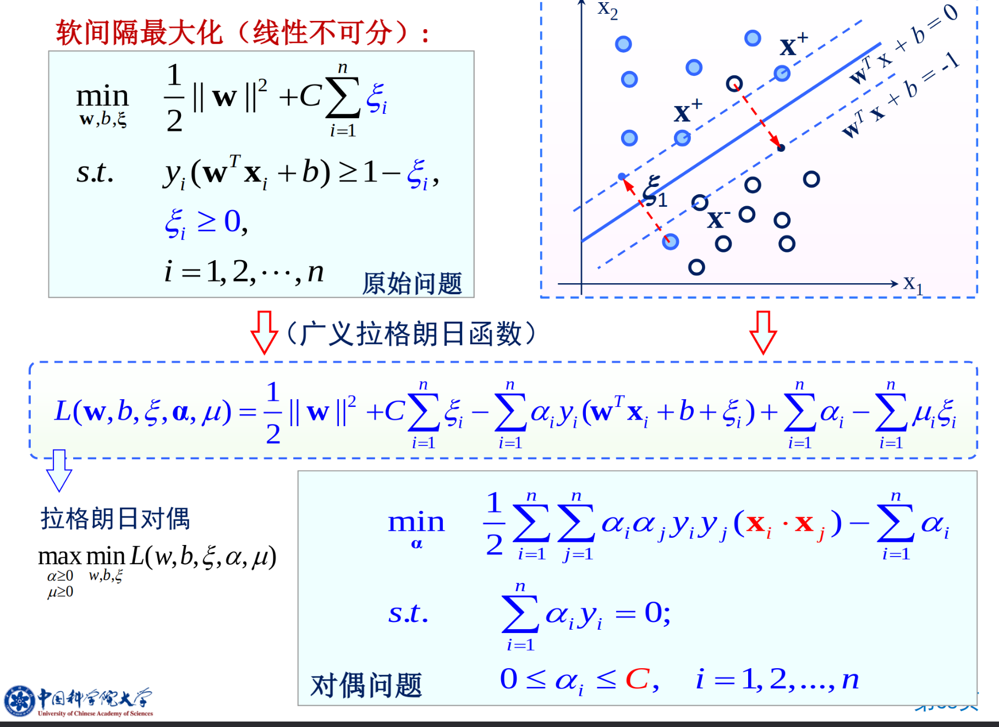

# 支持向量机与核方法

## 理论

我们始终目标是对于未知的数据获得最小的错误率。

Test error rate $\le$ train error rate + f(N,h,p)

我们要找到一个合适的中间点，来平衡损失和模型复杂度。

VC 维：能被H打散的最大示例集大小。就是可以完全可分的数据个数。可以视作这个模型的区分能力。

VC 维度越高，分类器就越灵活。不过在实践中，大多数分类器的VC维很难精确计算。

可是，对于过于复杂的情形，假设过度适配一系列可分平面，会降低泛化性能。于是换一种思路：最大化各样本到分类面的最小距离。最大化利用高维特征空间所带来的剩余容量。

## Hard-margin SVM

将线性分类器的间隔定义为在到达数据点之前可以增加的边界宽度。

如果在边界的位置上犯了一个小错误，那么造成错误分类的可能性就最小。

对于决策面为 $g(x) = w^T x + b = 0$，那么点x到决策面的距离为：$r = \frac{g(x)}{||w||}$

那么我们的目标就是  $arg \max_{w,b} \min_{x \in D} \frac{|b + x_i w|}{\sqrt{\sum w_i^2}}, s.t. \forall x_i \in D: y_i (x_i w + b) \ge 0$

其中 $\forall x_i \in D: |b + x_i w| \ge 1$ 是总是可以做到的，只需要增大 $w$ 即可。那么就转化为

$arg \min_{w,b} \sum w_i^2, s.t. \forall x_i \in D: y_i (x_i w + b) \ge 1$

那么线性可分类支持向量机，学习模型：估计最大间隔分类超平面。
$arg \min_{w,b} \frac{1}{2} ||w||^2, s.t. y_i (x_i w + b) - 1 \ge 0$，分类超平面： $w^Tx + b = 0$，分类决策函数：$f(x) = sign(w^Tx + b)$。

定义一： 对于线性可分数据集，最大间隔分类面存在且唯一。

## Soft-Margin SVM

对于不能线性可分的数据，如何解决这个问题。这是一个NP难题。

我们的想法就是最小化 $w w + C(train errors)$，但是训练误差不能被平方线性规划表达，求解太慢。

那么就有第二个想法，最小化一个错误点到正确位置的距离。

即：对于被错分的正样本，通过加上 $xi_i$ 变得正确分类，$y_i (w^T x_i + b) + \xi_i \ge +1$，同样的对于错分的负样本 $(w^T x_i + b) - \xi_i \le -1$。

这样引入了松弛变量 $\xi_i$，作为软间隔。但是我们有希望可以约束 $\xi_i$ 的大小，且不希望小于0。$\min \sum \xi_i$。

$\min_{w,b} \frac{1}{2} ||w||^2 + C\sum \xi_i, s.t. y_i (w^T x_i + b) \ge 1 - \xi_i, \xi_i \le 0$，其中前面的 $||w||^2$ 体现了表达能力，$\sum \xi_i$ 体现了经验风险。前面使得margin尽量大，第二项表示使得误差分类点的个数尽量小。

我们可以直接将约束放入优化表达式中：得到合页损失函数：$\min_{w,b} \sum [1 - y_i (w^T x_i + b)]_+ + \lambda ||w||^2$

## Dual problem

Lagrange multipilers

这个其实就是一个 $\min_x \max_{\alpha} L(x, \alpha) = \max_{\alpha} \min_x L(x,\alpha)$

支持向量机的对偶算法

在约束最优化问题中，经常使用拉格朗日对偶性将原始问题转化为对偶问题进行求解。对偶算法往往容易求解。对偶算法可以推广到核学习。

原始问题：

$arg \min_{w,b} \frac{1}{2} ||w||^2, s.t. y_i (x_i w + b) - 1 \ge 0$，分类超平面： $w^Tx + b = 0$，分类决策函数：$f(x) = sign(w^Tx + b)$。

对偶问题可以写为：

$\max_{\alpha} \min_{w,b} L(w,b,\alpha), s.t. \alpha_i \ge 0,L(w,b,\alpha) = \frac{1}{2} ||w||^2 - \sum \alpha_i \y_i(w^T x_i + b) + \sum \alpha_i$

那么就是求解 $\min_{w,b} L(w,b,\alpha),  \Delta_w L(w,b,\alpha) \rightArrow w = \sum \alpha_i y_i x_i, \Delta_b L(w,b,\alpha) = \sum \alpha_i y_i = 0 \rightArrow \sum \alpha_i y_i = 0$

就转化为了：$\min_{w,b} L(w,b,\alpha) = - \frac{1}{2} \sum_i \sum_j \alpha_i \alpha_j y_i y_j (x_i x_j) + \sum_i \alpha_i$

然后再对 $\alpha$ 求解极大值,

$\max_{\alpha} - \frac{1}{2} \sum_i \sum_j \alpha_i \alpha_j y_i y_j (x_i x_j) + \sum_i \alpha_i, s.t. \sum_i \alpha_i y_i = 0, \alpha_i \ge 0$

软间隔支持向量：支撑面以外的样本点。均有 $\alpha^* = 0$，支持向量：$\alpha^* > 0$，包含位于边界上的点，两个类边界以内的，以及错分点。

## kernel method

