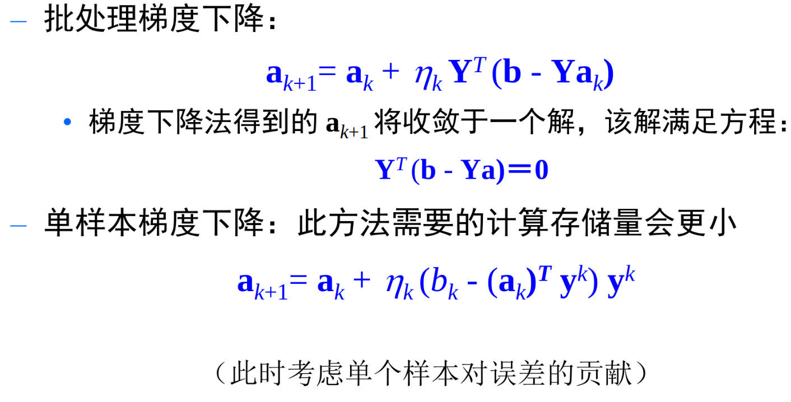

# 线性判别函数

判别模型

判别函数基本技术路线

- 假定判别函数的形式已知，采用样本来估计判别函数的参数。（学习问题）
- 对于给定的新样本，用判别函数判定x属于那一类（推理、预测问题）

## 线性判别函数

$$
g(x) = \sum_i w_i x_i + w_0 = W^T x + w_0
$$

这个就是线性分类器，可以将 $w_0$ 也放入权重向量 $W^T$ 中。

g(x) = 0 ，定义了一个决策面，其实就是与权重向量垂直的一个面。

**g(x) = 0 是一个超平面**。

任何向量样本x都可以被分解为决策面向量和与权重向量平行的向量，即：

$x = x_p + r \frac{w}{||w||}$,$r = \frac{g(x)}{||w||}$

其中 $x_p$ 是x在超平面中的投影，r为x到决策面的距离，正侧大于0，反之小于0。

!!! note "多类情形"

    - 一对多：逐一将每个类与所有的其它类进行配对，构造c(类别数）个两类分类器。若只有一个预测正，那么对应类别即为分类结果，否则存在不确定区域。
    - 一对一：两两配对，构造 $\frac{c(c-1)}{2}$ 个两类分类器。用投票法得到预测结果。
    - 多对多：ECOC,层次分类。

可以考虑最大判别函数决策

$g_i(x) = max_j g_j(x) \Rightarrow x \in w_i$

**线性决策面是凸的，且所有的决策区域都是单联通的，便于分析。**

但是，凸决策区域限制分类器的灵活性和精度，单联通区域不利于复杂数据的分布。

## 广义线性判别函数

将原先的数据点x通过非线性映射，将其映射为新的数据点y。在新的特征空间内应用线性判别函数。

!!! example "二次判别函数"

    $y_i(x) = x_i x_{j}$

    然后对y进行线性判别函数，其实就是对x进行二次函数的判别了。

    这里还可以进行升维，y的维度是所有二次项(x_ix_j)和一次项的和。

    这里我们可以记 y(x) 为变换函数。

    广义判别函数对于y来说是线性的，对于x来说是非线性的。

    **新空间维数足够高，可以g(x)逼近任何函数**

## 感知准则函数

可以先对样本进行规范化增广：先将所有样本写成齐次增广形式，然后将属于另一个分类$w_2$的样本y变为 $-y$。这样就可统一 $a^ty > 0$ 。

在线性可分的情况下，将 $a^Ty_i > 0$ 的权向量a称为解向量。

对于多个样本，每个样本其实会对 $a$ 产生一个限制（y的垂直平面上）。那么最终的解向量其实就是这个n个样本产生
的n个超平面的交集。

**可行的解向量不是唯一的，有无穷多个，所以越靠近区域中间越好（经验）**

所以引入 $b, a^T y \ge b > 0$，这样解更加可靠，推广性更强，并且防止算法收敛到解区的边界。

**感知准则函数**

$J_p(a) = \sum_{y \in Y} (-a^T y)$

其中Y为错分样本集合。当y被错分时，$a^T y \ge 0$，则$-a^T y \ge 0$。

所以目标就是最小化 $J_p(a)$。感知器思想。Perceptron

梯度下降法

$\frac{\partial J_p(a)}{\partial a} = - \sum_{y \in Y} y$

所以更新准则为$a_{k+1} = a_k - \eta_k \frac{\partial J_p(a)}{\partial a} = a_k + \eta_k \sum_{y \in Y} y$

其中 $a_{k+1}$ 是当前迭代结果，$a_k$ 是前一次迭代结果，$\eta_k$ 是步长因子、更新动力因子、学习率。

这样做，就是可变批量处理感知器算法。也可以每次只处理一个错分样本，考虑每次$\eta_k = 1$。

**几何解释，错分样本是位于决策面的负侧，那么样本的和也在该侧。更新之后会向错分样本之和靠近，朝着有利的方向移动**

在样本线性可分的情况下，固定增量单样本权向量修正方法收敛，并可得到一个可行解。

## 松弛准则

其实可以有多种准则可以用于感知函数的学习

!!! example "学习准则"

    - 线性准则: $J_p(a) = \sum_{y \in Y} (-a^T y)$
    - 平方准则: $J_q(a) = \sum_{y \in Y} (a^T y) ^2$
    - 松弛准则: $J_r(a) = \frac{1}{2} \sum_{y \in Y} \frac{(a^T y - b)^2}{||y||^2}$，注意这里的Y为 $a^T y \le b 的样本集合$

松弛准则，避免了线性准则分段线性、梯度不连续的缺点，避免了平方准则目标函数过于平滑、收敛速度很慢的缺点。

梯度 $\frac{\partial J_r(a)}{\partial a} = - \sum_{y \in Y} \frac{a^T y - b}{||y||^2} y$

几何解释 若$\eta = 1$，则 $a_k$ 直接移动到该超平面，错分被引起的压力 $a^T y^k \le b$ 被释放，所以称为松弛。

## 最小平方误差

MSE 准则。

之前都是认为该判定函数大于0即可，不要去具体的值。

这里我们直接给一个确定的值，即 $a^T y_i = b_i > 0$

那么按照行排列，即可写成矩阵乘向量形式

$$
\begin{pmatrix}
y_1 \\ y_2 \\ ... \\ y_n
\end{pmatrix}
a
= b
$$

然后其实就是最小二乘解，最小化误差 $||e||^2 = ||Ya - b||$

其实转化为求解 $Y^T Ya = Y^T b \Rightarrow a = (Y^T Y) ^{-1} Y^T b$

也可以使用梯度下降法

最小平方准则方法可能并不收敛于可分超平面，即使该平面是存在的。

**MSE方法的本质是最小化样本至超平面的距离的平方和**

## Ho-Kashyap

我们可以将b也设为参数，即为

$J_s(a,b) = ||Ya-b||^2,b > 0$

同样的，进行梯度下降。具体看ppt。

## 多类线性判别

- MSE 多类扩展，其实就是采用c个两类分类器组合
- 感知器准则扩展方法，一次性学出c个权重向量
- Kelser 构造，将所有的权重向量a拼成长向量，然后构造新样本。
