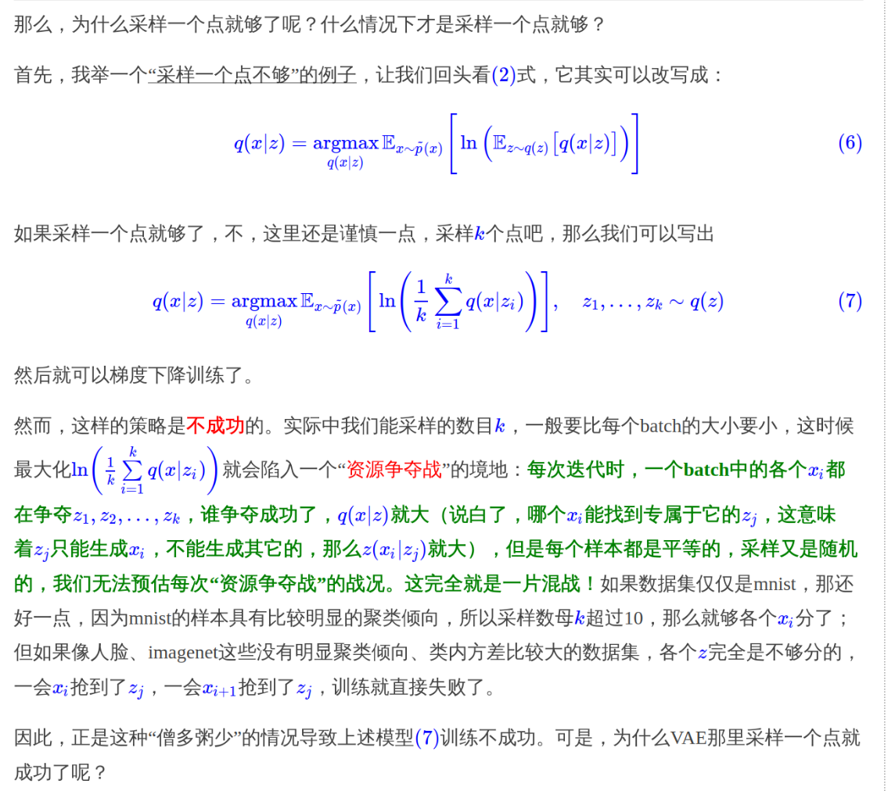

# VAE变分自编码器

## 数值计算vs采样

例如要求解一个期望

$E(x) = \int x p(x) \mathrm{d}x$

如果是使用数值计算，则需要选取一系列有代表性的点。
如：$x_0 < x_1 < x_2 < .... < x_n$

然后进行计算 $E(x) \approx \sum_i x_i p(x_i)(x_i - x_{i-1})$

这里只是有代表性的点，但是这些点并不服从 $p(x)$ 分布，所以计算的式子中还是需要计算 $p(x)$。

采样：就是从$p(x)$ 中采样出ｎ个点 $x_1,x_2,x_3,...,x_n$。

这时候：$E(x) \approx \frac{1}{n} \sum_i x_i, x_i ~ p(x)$

由于采样中$x_i$ 是直接一概率采样出来的，则概率大的 $x_i$ 出现次数就会比较多，可以说采样的结果已经包含 $p(x)$ 了。 

## VAE

基本问题就是有一堆样本 $x_1,x_2,...,x_n$，我们希望从这个样本集中获得分布 $p(x)$。然后就可以采样了。

我们可以假设这个ｘ是由一个隐变量ｚ得到的。

$p(x) = \sum_z p(x|z) p(z)$

先说，假设$p(z|x_k)$ 是标准正态分布，因为我们之后要把这个第k个变量对应的ｚ再还原成 $x_k$。

**神经网络时代的哲学：难算的我们都使用神经网络来拟合**

在这里我们希望将 $p(z|x)$　尽可能接近标准正态。我们在重构误差上，加上额外的ｌｏｓｓ。

这里直接将　普通正态和标准正态的KL 散度作为这个额外的ｌｏｓｓ，这样避免分配均值和方差在损失中占的比例。

然后使用重参数技巧，从标准正态采样，然后进行变换，得到需要的采样，这样变为采样的结果参与训练，使得整个模型可以训练了。

重构的过程希望没有噪声，而KL损失则是希望有高斯噪声，两者是对立的。所以内部包含了一个对抗的过程，只不过它们是混合起来的，共同进化的。

并且，每个变量对应的 $p(z|x_k)$ 不是完全等于标准正态的，否则就和 x无关了，那么重构的效果将会极差。最后训练结果就是，$p(z|x)$ 保留了一定的X信息，重构效果也还可以。

!!! note "这里为什么要假设p(z|x) 是正态，不能是均匀等分布"

    因为KL散度中，只要两个分布不同，则KL loss就会很大，模型就会迅速降低kl loss。那么噪声和重构无法起到对抗作用。

    如果非要使用，则需要算好除零错误，加大重构损失权重。。

我们也可以从贝叶斯角度直接出发

从 $p(x,z)=  p(x)^{var} p(z|x)$，我们要找到一个尽可能接近的，这样即找到了编码器。

我们使用 $q(x,z)$ 来逼近这个，那么让 $kl(p(x,z) || q(x,z))$ 尽可能小。

最后可以推出来 $KL - C = -\int \int p(x,z) log q(x|z) + kl(p(z|x) || q(z))$

那么就是找到适当的 $q(z),q(x|z)$，就是适当的隐变量分布和decode方法，让kl尽可能小。

对于这个式子，我们不能将它们分开来看。因为kl如果很小，就说明z没有什么辨识度，自然decoder函数就会很差，所以 -log(q(x|z)) 就会很大。
如果 -log(q(x|z)) 很小，就说明 q(x|z) 很大，预测很准确，这个时候 p(z|x) 就不会很随机，则 KL 就不会很小。

然后我们就开始假设了，假设 $p(z|x)$ 是正态，这样$q(z)$ 也就是正态了。

然后假设$p(x|z)$ 是正态或者伯努利。

为什么要假设是正态：
然而并没有办法，因为我们要构造一个分布，而不是任意一个函数，既然是分布就得满足归一化的要求，而要满足归一化，又要容易算，我们还真没多少选择。

当假设为伯努利的时候，使用 sigmod 作为激活函数，使用交叉熵作为损失函数。
对于假设为正态分布，我们用MSE作为损失函数对应于 $q(x|z)$ 作为固定方差的正态分布。

现在有了上面的假设之后，那个KL的式子我们都可以计算出来，那么还缺什么东西？

采样，因为KL是要求解期望

其中 $p(z|x)$ 一部分用于计算 $kl(p(z|x) || q(z))$，另一部用来计算 $-\sum_z p(z|x) log q(x|z)$ ，使用采样进行计算。

采样多少才合适？VAE 选择了采样一个。

对于每一个x，都需要从 $p(z|x)$ 采样一个专属的z来计算 $-logp(x|z)$。

!!! note "为什么这里采样一个样本就足够了"

    实际上我们会运行多个epoch，每次隐变量都是随机的，因此当epoch足够，是可以保证，采样充分性。

## VAE为什么可以？

这里我们考虑对于 $q(x|z)$ 的想法，这个是模型的生成部分，也就是decoder。

由于伯努利应用有限，我们只考虑正态。

我们从$q(z)$采样出z后，带入 $q(x|z)$的到具体形式，理论上我们还要再采样一次才能得到x，但是我们直接使用 $\mu(z)$ 结果就当作了x。

这表明， $q(x|z)$ 是一个方差很小的正态分布，每次采样的结果几乎相同，这个时候x与z几乎就是一一对应关系。

我们对问题其实是有一个先验知识的，对于某个数据集做VA时，数据集本身就带了很强的约束。比如数据集图片是无穷图片中的一个小子集而已。

那么我们就可以将数据集X投影到一个低维空间，让低维空间和x一一对应。这个就是普通的自编码器。

## IWAE

重要性加权自编码器

$p(x) = \int p(z) p(x|z) = \int p(z|x) \frac{p(x|z)p(z)}{p(z|x)}$

那么由于说 $p(z|x)$ 从 x 到 z的映射是一一对应的，那么我们采样几个点就行了

$\frac{1}{k} \sum_k \frac{p(x|z) p(z)}{p(z|x)} , z ~ p(z|x)$

当采样k足够大的时候，$p(z|x)$  的具体形式就不重要了。

在这里，IWAE 削弱了encoder $p(z|x)$ 的作用，换来了模型 $p(x|z)$ 的提升。

## 重参数

VAE 当引入了后验分布，使得采样从宽松的标准正态分布 $q$ 转移到紧凑的正态分布 $p(z|x)$。

当我们跑网络训练出了均值和方差，这两个向量。就可以构建正态分布然后采样了。

但是采样出的向量无法得到与均值方程之间的关系，相当于一个常量，一求导就没了。

这样在梯度下降中就没有反馈来更新均值和方差。

所以引入重参数。

## 一步到位的聚类方案

定义的隐变量可以是离散的。

所以我们从原先的 z 变为定义 $(z,y)$ ，其中 y 代表聚类为第i类。

$KL(p(x,z,y) || q(x,z,y)) = \sum_y \int \int p(x,z,y) log \frac{p(z,y|x) p(x)}{q(x|z,y) q(z,y)}$

有多种实现方式，这里只选择其中一种

其中 $p(z,y|x) = p(z|x) p(y|z), q(x | z,y) =  p(x | z), q(z,y) = q(z | y)q(y)$

那么就转化为了

$KL(p(x,z,y) || q(x,z,y)) = \sum_y \int \int p(x) p(z |x) p(y|z) log \frac{p(z |x) p(y|z) p(x)}{q(x|z) q(z|y) q(y)}$

这个式子描述了编码和生成的过程。

首先先采样一个x，然后使用 $p(z|x)$ 得到编码特征z ，然后通过 $p(y|z)$ 得到分类y。

生成的时候先从 $q(y)$ 中采样出一个 类别y。然后根据 $q(z|y)$ 采样得到编码特征 z,然后生成出 $q(x|z)$. x。

p(z|x)一般假设为均值为μ(x)方差为σ2(x)的正态分布，q(x|z)一般假设为均值为G(z)方差为常数的正态分布（等价于用MSE作为loss），q(z|y)可以假设为均值为μy方差为1的正态分布，至于剩下的q(y),p(y|z)，q(y)可以假设为均匀分布（它就是个常数），也就是希望每个类大致均衡，而p(y|z)是对隐变量的分类器，随便用个softmax的网络就可以拟合了。

@online{kexuefm-5253,
        title={变分自编码器（一）：原来是这么一回事},
        author={苏剑林},
        year={2018},
        month={Mar},
        url={\url{https://spaces.ac.cn/archives/5253}},
}
