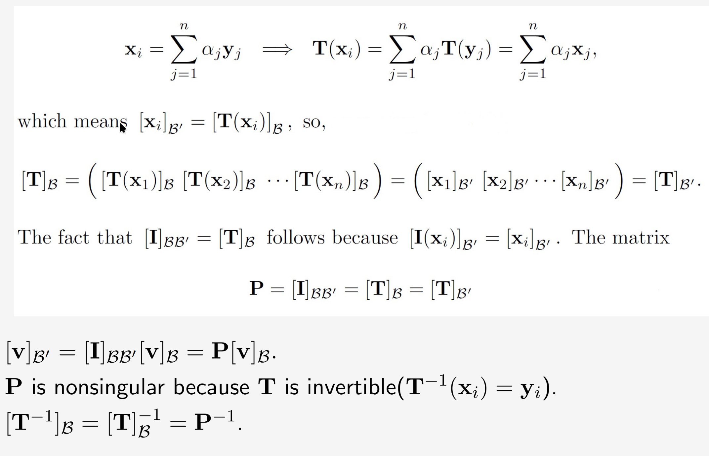

# 线性变换

!!! note "线性变换"

    $U$ 和 $V$ 是在 $F$ 上的两个线性空间。

    一个线性变化 linear transformation from u to v is defined to be a linear function T。

    $T(x+y) = T(x) + T(y)$ and $T(ax) = aT(x)$

线性变换是否可以被一个矩阵代表？

线性变换在有限维空间中，总是可以有一个矩阵表示。

!!! note "空间线性变换"

    对于每一对向量空间$U$和$V$，集合 $L(U,V)$ 是一个线性变化从 U到V。

    记这两个向量空间的基分别为 $B=\{\mu_1,\mu_2,....,\mu_n\}$ 和 $B^{'}= \{ v_1,v_2,...,v_m \}$，

    并且定义线性变换从u到v： $B_{ji}(\mu)=\xi_jv_i$，其中 $[\mu]_B = (\xi_1,\xi_2,...,\xi_n)^T$ 是坐标。

    那么 $B_L = {B_{ji}}^{i=1...m}_{j=1..n}$ 是 $L(U,V)$ 的一个基。

    $dimL(U,V) = (dimU)(dimV)$

    先证明线性无关：

    先记$\sum \eta_{ji} B_{ji}=0$，那么对于 $\mu_k \in B$来说，

    $B_{ki}(\mu_k) = v_i$ 并且 $B_{ji}(\mu_k) = 0(j \ne k)$

    那么 $\sum \eta_{ji} B_{ji}(\mu_k)= \sum \eta_{ki} v_i = 0$

    由于 $v_i$ 是一个基，所以 $\eta_{ki} = 0$ ，同理，就可以得出 $\eta_{ji}= 0$，即证明线性无关。

    再证明$B_{ji}$ 可以span 成集合L(U,V)。
    
    那么记任意$T \in L$，即$T(\mu_j) = \sum_i a_{ji} v_i$，并且记 $\mu = \sum_j \xi_j \mu_j$

    那么$T(\mu) = \sum_j \xi_j T(\mu_j) = \sum_j \xi_j \sum_i a_{ji} v_i = \sum_{i,j} xi_j a_{ji} v_i= \sum_{i,j} a_{ji} B_{ji}(\mu)$

    这样就证明了 $B_{ji}$ 可以span 集合L。

那么 $[T]_{BB^{'}}=([T(\mu_1)]_{B^{'}},[T(\mu_2)]_{B^{'}},...,[T(\mu_n)]_{B^{'}})$

并且这里的矩阵元素其实就是上面推导过程中的a。

矩阵乘法的行为，对于一个线性变换

$[T(\mu)]_{B^{'}} = [T]_{BB^{'}} * [\mu]_{B}$。（其实就是一个坐标变换，从基为B变换为基为 $B^{'}$）

!!! note "change of basis operator"

    我们定义change of basis operator 是 $T(y_i) = x_i$。就是将记为y换为基为x。基换了，但是坐标没换。

    那么就有：$P=[T]_B = [T]_{B^{'}} = [I]_{BB^{'}} = ([x_1]_{B^{'}},[x_2]_{B^{'}},...,[x_n]_{B^{'}})$

    有如下性质 $[v]_{B^{'}} = P * [v]_B$，P是一个非奇异矩阵。

    证明如下

    

[ppt](课件6.pdf).
