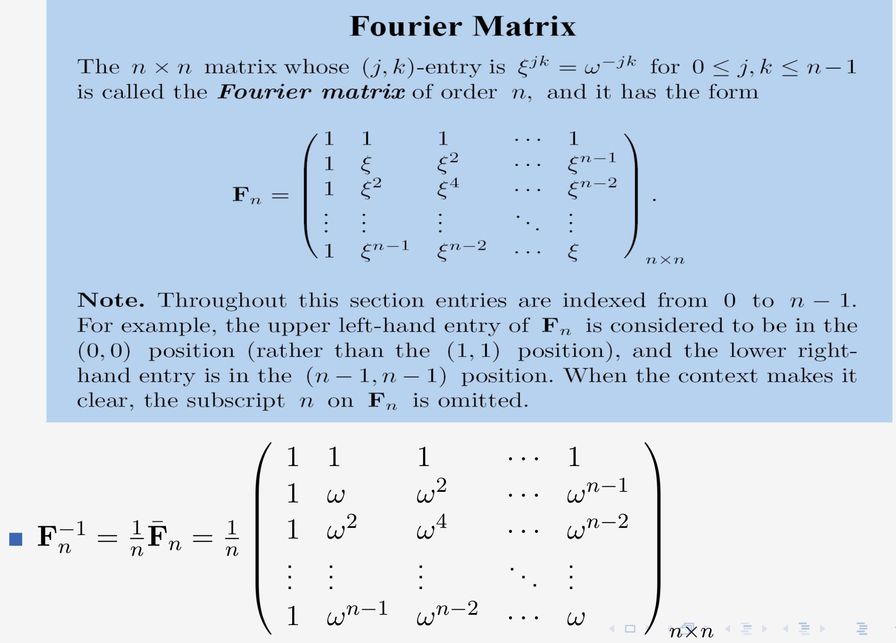
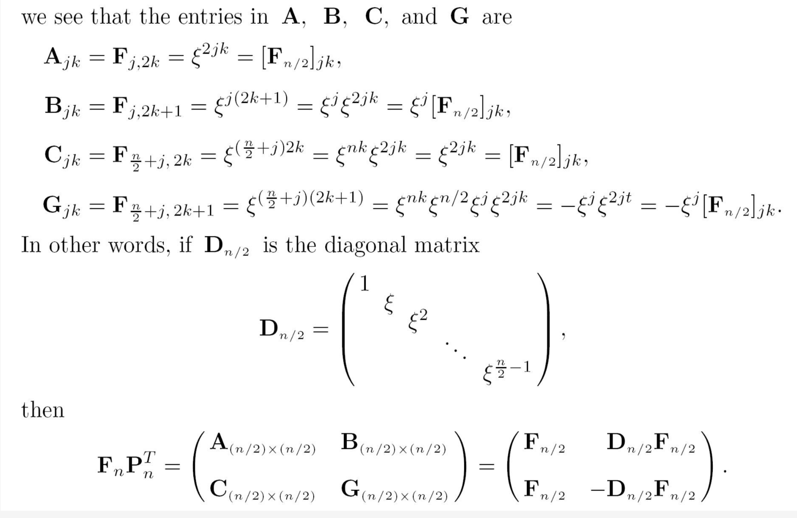
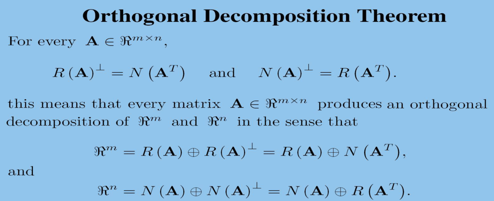
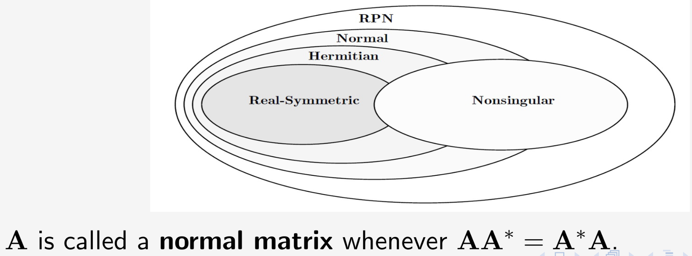

# 模和内积 二

## Orthgonal Reduction

Household 也可以像高斯消元一样，将将一个矩阵变换为行阶梯型。

!!! note "Household reduction"

    对于一个矩阵 $A_{m\times n} = [ A_{*1},A_{*2},...,A_{*n} ]$

    先构建第一个 elementary reflector ：$R_1 = I - 2 \frac{u u^*}{u^* u}$ 其中 $u = A_{*1} \pm \mu ||A*1||e_1$

    那么 $R_1 A_{*1} = \mp \mu ||A_{*1} e_1 = (t_{11},0,...,0)^T$

    则应用于矩阵之后可以得到 

    $$R_1A = 
    \begin{pmatrix}
        t_{11} & t_1^T \\
        0 & A_2 \\
    \end{pmatrix}
    $$

    那么对于 $A_2$ 构造 elementary reflector 记为 $\widehat{R_2}$。

    那么记 

    $$R_2 = 
    \begin{pmatrix}
        1 & 0 \\
        0 & \widehat{R_2} \\
    \end{pmatrix}
    $$

    则：

    $$
    R_2 R_1 A = 
    \begin{pmatrix}
        t_{11} & t_1^T \\
        0 & \widehat{R_2} A_2 \\
    \end{pmatrix}
    $$
 
    同样的步骤执行 $k-1$ 步，即可化为行阶梯型

Givens reduction 也可以进行同样的过程，都是 $A = QR$

**解决最小二乘解的问题**

其实就是最小化 $\sum_i \varepsilon_i^2 = \varepsilon^t\varepsilon = ||\varepsilon||^2$

那么假设A可以消元为T被正交矩阵P(保长度的)，PA=T

$$
||\varepsilon||^2 = ||P\varepsilon ||^2 =
||P(Ax-b)||^2 = ||Tx - Pb||^2=
||
\begin{pmatrix}
R \\ 0 \\
\end{pmatrix} x - 
\begin{pmatrix}
c \\ d \\
\end{pmatrix}
||^2=
||
\begin{pmatrix}
Rx - c \\ d \\
\end{pmatrix} ||^2=
||Rx-c||^2 + ||d||^2
$$

就是说需要最小化 $||Rx - c||^2$

我们现在有四种不同的方式进行分解1. Gaussian 消元2. Gram-Schmidt 正交化 3. Householder 4. Givens

假设浮点运算，产生了一个正交矩阵 Q + E,一个上三角矩阵 R+F

$\widehat{A} = (Q + E)(R+F) = QR + QF + ER + EF = A + QF + ER + EF$

E,F都是一个很小的误差，那么 $EF$ 乘积也是很小的误差，可以忽略。

然后由于Q是正交的，$||QF||_F = ||F||_F$并且 $||A||_F = ||QR||_F = ||R||_F$

$||ER||_F \le ||E|| ||R|| = ||E|| ||A||$ 由于E比较小，所以相对于A也比较小。

QF,ER相对于A都是较小的，所以可以说算法是稳固的。 故对于微小扰动很稳固。

而对于高斯消元来说，

$\widehat{A} = (L + E)(U+F) = A + LF + EU + EF$

其中EF也是很小的，但是LF不能确定，因为L可能会很大。

但是可以使用部分主元法，这样会保证L中元素很小，因为L中存储的就是消元时倍数。

EU不能忽视，U可能会很大，全部主元法可以将让U也变得很小。

所以全部主元法，是一个稳定的算法。

## Fourier Transform

我们可以定义 $\omega= e^{2\pi i / n} = cos \frac{2\pi}{n} + i sin \frac{2\pi}{n}$

那么这个其实就是 $Z^n = 1$ 这个方程所有的解。

同样可以定义 $\xi =  e^{-2\pi i / n} = cos \frac{2\pi}{n} - i sin \frac{2\pi}{n}$

傅里叶变换其实就是一个特殊的 Vandermonde 矩阵。该矩阵是正交，但是不是标准的。就是说 $\frac{1}{\sqrt{n}}F_n$ 是一个 酉矩阵。

对于该矩阵的逆计算也很方便，可以通过傅里叶矩阵的共轭转置再除以n，这里n就是补偿之前的 $\sqrt{n}$。

对于一个向量做傅里叶变换即 $[F_n x]_k = \sum_j x_j \varepsilon ^{jk}$，对于逆变换，其实可以通过先对x求共轭转置，然后做一次傅里叶变换，再除以n即可得到。

傅里叶变换可以进行信号的处理，也可以解决卷积乘法（多项式乘法）

傅里叶变换可以将原先复杂度卷积乘法转化为简单的对应元素相乘。

这里只是简单的傅里叶变换时间花费是很大的，然后有一种更快的方法。

对于求解 $F_n x$ 考虑分解成子问题，将偶数列向前移动，就可以得到 $F_n P^T P x$。如下所示：

可以进行递归分解。最终的的计算其实是通过这个递归就转化为了多个向量的加加减减。

这样计算快速傅里叶可以达到时间复杂度为 $O(\frac{n}{2} log_2n)$

## Complementary Subspace

定义：当 $\mathcal{V}$ 的子空间 $\mathcal{X},\mathcal{Y}$ 满足 $\mathcal{V} = \mathcal{X} + \mathcal{Y}$ 并且 $\mathcal{X} \cap \mathcal{Y} = 0$

可以称 direct sum ，是这两个空间运算出整个空间。

这里必须是沿着某个方向向另一个方向进行投影，因为对于一个子空间 $\mathcal{X}$ 可以有多个补空间，即补空间不唯一，所以不能直接说向某个子空间做投影。

沿着不同的子空间可能会导致不同的结果。

**一个矩阵可以分解成一个对称加上非对称，对称阵与反对称阵也是补向量**

可以定义一个矩阵代表这个投影运算，$Pv$

!!! note "Projector"
    
    $P$ 是沿着 $\mathcal{Y}$向$\mathcal{X}$投影

    - $P^2 = P$
    - $I - P$ 是沿着$\mathcal{X}$ 向 $\mathcal{Y}$ 投影矩阵
    - 并且该矩阵作用在 $\mathcal{X}$ 上不变即 $Px=x$
    - $R(P) = N(I-P) = \mathcal{X}$
    - $R(I - P) = N(P) = \mathcal{Y}$
    - $P = [X|0][X|Y]^{-1}$

这里如果矩阵是幂等，则一定是投影矩阵，是冲要条件。

## 值零分解

Range-Nullspace decomposition

很合理的方向，去思考值空间和零空间这些基本子空间的关系。通过这些关系是否是互补子空间，来进行分解。

**重点是考虑A是奇异矩阵的时候**

先考虑对于一个矩阵，值空间和零空间是否是补空间。

$$
A = 
\begin{pmatrix}
0 & 1 \\
0 & 0 \\
\end{pmatrix},
\begin{pmatrix}
1 \\ 0 \\ 
\end{pmatrix},
$$

这个向量即属于值空间，也属于零空间。所以这个对于一般矩阵来说是不成立的。

但是可以定义 $A^k$，因为矩阵越乘值空间越小，又因为行数的限制，所以最终值空间会小到一个界限不再小。

这个时候，$A^k$ 的值空间和零空间是补空间。

这个$k$称为 $index \space of \space A$

$Rank(A^k) = Rank(A^{k+1})$

这里再引申一个概念，如果恰好这个时候 $A^k=0$，就称为幂零阵，nilpotent matrice

!!! note "core-Nilpotent decompostion"

    对 $n \times n$ 的奇异矩阵,核零分解

    $$Q^{-1}AQ=
    \begin{pmatrix}
    C_{r\times r} & 0 \\
    0 & N \\
    \end{pmatrix}
    $$

    Q 是 $A^K$ 的值域空间一组基与零空间一组基

## Orthogonal Decomposition

正交分解。

定义M的正交补为 $M^{\perp} = \{x\in \mathcal{v} | <m|x> = 0 \forall m \in M\}$ 组成的子空间。

四个基本子空间的关系

!!! note "URV factorization"

    $$
    A = URV^T=
    U
    \begin{pmatrix}
    C_{r\times r} & 0 \\
    0 & 0 \\
    \end{pmatrix}
    V^T
    $$

    其中U的前r列是 $R(A)$ 的标准正交基，后 $m-r$列是 $N(A^T)$的一组标准正交基

    其中V的前r列是 $R(A^T)$ 的标准正交基，后 $m-r$ 列是 $N(A)$ 的标准正交基。

这里URV与核零分解，URV是正交矩阵（保长度，角度），二核零是同一个线性变换在不同基下的表示。

对于一个特殊的矩阵RPN ，URV分解与核零分解是相同的。

## SVD 分解

Singular value Decomposition

奇异值

正交投影

$P_M = M(M^TM)^{-1}M^T$

因为

$$
(M|N)^{-1} = 
\begin{pmatrix}
(M^TM)^{-1}M^T \\
N^T
\end{pmatrix}
$$

所以对于这个可以直接使用投影矩阵来计算出P是什么

出了幂等 $P^2=P$，还需要下面条件即可是正交投影

- $R(P) \perp N(P)$
- $P^T = P,(P^2 = P = P^T)$
- $||P||_2 = 1$

最近点距离

$min_m ||b - m||_2 = || b - P_M b||_2 = ||(I-P_M) b||_2$

正交投影也可以做最小二乘

最小二乘解，对于Ax=b，如果不可解

那么我们希望找到 $Pb \in R(A)$,$P_{R(A)}Ax = P_{R(A)}b$，左边本啦就是值域空间，作用之后不会改变。

$P_{R(A)} (Ax - b) = 0$，其中 $Ax-b$ 就是 $R(A)$ 正交补空间，$R(A)$的正交补就是$N(A^T)$，所以 A^T (Ax - b) = 0

[课件8](课件8.pdf)
